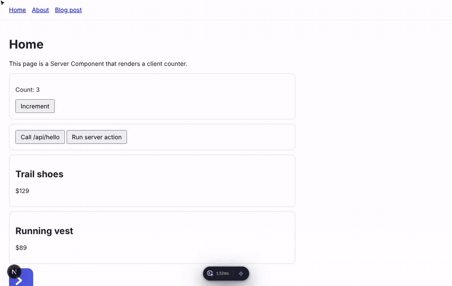

# Next DevTools

A [Nuxt DevTools](https://devtools.nuxt.com)-style panel for **Next.js**. Hover any element to see which component rendered it, click to jump to the exact line in your editor, browse the component tree (Server Components included), every route, your `public/` assets and Web Vitals — without leaving the page.

Works with the **App Router and Pages Router**, **Turbopack and webpack**. Tested on Next.js 15 and 16 (React 19); Next.js 14 is supported on a best-effort basis. Development only: production builds contain none of it.



<sub>The demo runs <a href="examples/app-router">examples/app-router</a> on Next.js 16 with Turbopack: inspect elements and open their source, browse the tree with Server Components and live state, visit a dynamic route, check the layouts for the current URL, read Web Vitals.</sub>

> Successor of [react-inspector-devtools](https://github.com/fadhelmurphy/react-inspector-devtools). That project needed the React DevTools extension and `_debugSource`, which React 19 removed. This one tags JSX at compile time, so it works on React 18 and 19, in Server Components, with no browser extension.

## What's in the panel

| | |
|---|---|
| **Overview** | Project at a glance: Next/React/Node versions, bundler, counts for pages, components, API routes, packages and assets (each opens its tab), an update badge when a newer Next.js is out, and the layouts + page that render the current URL. |
| **Inspector** | Hover anything on the page: component name, Server/Client, file and line, size. Click opens the file in your editor at that line. Shift + click keeps inspecting. |
| **Components** | *On this page*: the live tree including **Server Components** (React 19), with props, `useState` values and an Open in editor button (or double-click a row). *All in project*: every component file, whether it renders on the server or client, its role (page, layout, loading…), which files import it, and which ones are on the current page. |
| **Routes** | Every page and API route from `app/` and `pages/`: route groups, dynamic, catch-all, parallel and intercepting routes. Fill in params and visit; the current route is highlighted. |
| **Assets** | Everything in `public/` with previews, sizes, copy-URL. |
| **Packages** | Dependencies with installed and latest versions from the npm registry, major/minor/patch badges and a copyable upgrade command. |
| **Config** | Your resolved `next.config` (functions and regexes shown readably) and the `.env*` files Next loaded — `NEXT_PUBLIC_*` values shown, server-only values hidden. |
| **Payload** | Current route, `params` and `searchParams`. Pages Router: `__NEXT_DATA__` / `pageProps`. App Router: props your Server Components received and the size of the inlined RSC payload. |
| **Network** | Requests made from the browser while you use the app, labelled RSC, Server Action (with action id and arguments), API route, fetch or external, plus client navigations. Headers, request body and JSON responses. |
| **Performance** | LCP, INP, CLS, FCP, TTFB for the page load, document load phases, resources by type. |

## Requirements

| | Required | Notes |
|---|---|---|
| **Next.js** | 14.0 or newer | Tested on 15.5 and 16.3. Next 16 gets the full Turbopack integration (rules skip `node_modules`); on 14/15 a `*.tsx` / `*.jsx` Turbopack rule you already have takes precedence. |
| **React / React DOM** | 18.2 or newer | **Server Components in the tree need React 19** (it's what Next's App Router ships). On React 18 you still get the inspector, client components, props and state. |
| **Node.js** | 18.18 or newer | Whatever your Next.js needs wins: Next 15 runs on 18.18+, Next 16 needs 20.9+. |
| **Mode** | `next dev` only | Nothing is added to `next build` / `next start`. |
| **Bundler** | Turbopack or webpack | Both are configured automatically (`next dev`, `next dev --turbopack`, `next dev --webpack`). |
| **Router** | App Router, Pages Router, or both | Mixed projects are fine; routes from both show up. |
| **Browser** | Any current Chromium, Firefox or Safari | Needs Shadow DOM and `PerformanceObserver`. INP is only reported by Chromium browsers. |
| **Local port** | `4590` free on `127.0.0.1` | Used by the local API (routes, assets, open-in-editor). Change it with the `port` option. |
| **Editor** (optional) | VS Code, Cursor, Windsurf, Zed, WebStorm, Sublime, Vim… | Auto-detected from running processes, or set `LAUNCH_EDITOR` / the `editor` option. URL schemes work without any CLI on your `PATH`. |
| **Package manager** | npm, pnpm, yarn or bun | No postinstall scripts, three small runtime dependencies (`@babel/parser`, `magic-string`, `launch-editor`). |

Not supported: React Native / Expo, standalone Vite or CRA apps (this package hooks into `next.config`), and opening files when the browser runs on a different machine than `next dev` (the local API listens on `127.0.0.1`; use an editor URL scheme in Settings instead).

## Install

### Quick setup (one command)

Run inside your Next.js project:

```bash
npx github:fadhelmurphy/next-devtools init
```

It installs the package from this repo with your package manager (npm, pnpm, yarn or bun, picked from your lockfile), wraps `next.config` with `withNextDevtools()`, and adds `<NextDevtools />` to `app/layout` and/or `pages/_app`. Running it twice changes nothing. Flags: `--dry-run`, `--no-install`, `--npm` (install from the npm registry once published).

### Manual setup

```bash
npm i -D github:fadhelmurphy/next-devtools
# pnpm add -D github:fadhelmurphy/next-devtools
# yarn add -D github:fadhelmurphy/next-devtools
# bun add -d github:fadhelmurphy/next-devtools
```

The repo ships a prebuilt `dist/`, so installing from GitHub needs no build step and no dev dependencies. Pin a commit or tag with `github:fadhelmurphy/next-devtools#<sha-or-tag>`.

**1. Wrap your Next config**

```ts
// next.config.ts
import type { NextConfig } from "next";
import { withNextDevtools } from "@fadhelmurphy/next-devtools";

const nextConfig: NextConfig = {
  /* your config */
};

export default withNextDevtools(nextConfig);
```

`next.config.js` (CommonJS) works too: `const { withNextDevtools } = require("@fadhelmurphy/next-devtools")`. Function configs (`(phase) => config`) are supported.

**2. Render the panel once**

App Router — `app/layout.tsx`:

```tsx
import { NextDevtools } from "@fadhelmurphy/next-devtools/client";

export default function RootLayout({ children }: { children: React.ReactNode }) {
  return (
    <html lang="en">
      <body>
        {children}
        <NextDevtools />
      </body>
    </html>
  );
}
```

Pages Router — `pages/_app.tsx`:

```tsx
import type { AppProps } from "next/app";
import { NextDevtools } from "@fadhelmurphy/next-devtools/client";

export default function App({ Component, pageProps }: AppProps) {
  return (
    <>
      <Component {...pageProps} />
      <NextDevtools />
    </>
  );
}
```

Run `next dev`, then press **Shift + Alt + D** or click the button at the bottom of the page.

## Keyboard

| Keys | Action |
|---|---|
| Shift + Alt + D | Open / close the panel |
| Shift + Alt + C | Inspect an element and open its source |
| Shift + click | Open source and keep inspecting |
| Esc | Stop inspecting, then close the panel |

## Options

```ts
export default withNextDevtools(nextConfig, {
  port: 4590,        // local API port (or NEXT_DEVTOOLS_PORT)
  editor: "cursor",  // editor command for open-in-editor (or LAUNCH_EDITOR); auto-detected by default
  root: __dirname,   // project root, if you run `next dev` from another directory
  inspector: true,   // set false to skip injecting source locations
  enabled: true,     // or NEXT_DEVTOOLS=0 to turn everything off
});
```

`<NextDevtools enabled={false} />` hides the panel without touching the config. In the panel's Settings you can also pick an editor URL scheme (VS Code, Cursor, Windsurf, Zed, WebStorm), switch to a light theme, or hide the floating button.

## How it works

- **Source locations.** In `next dev` only, a small loader runs before SWC and adds `data-nd-src="app/page.tsx:12:5"` to every lowercase JSX element (`<div>`, `<button>`…). Components are never touched, so no unknown props reach your code. Because it happens at compile time, it works for Server Components, which never exist on the client as fibers. Registered for both webpack (`enforce: "pre"`) and Turbopack (`turbopack.rules`, skipping `node_modules`).
- **Component tree.** Read straight from React's fiber tree via the DOM (`__reactFiber$…`); no React DevTools extension needed. Server Components come from React 19's dev-only `_debugInfo`.
- **Project data.** `withNextDevtools` starts a tiny HTTP server on `127.0.0.1` (default port 4590) during `next dev` for routes, assets, project info and open-in-editor (via [`launch-editor`](https://github.com/yyx990803/launch-editor)). Requests need a per-project token that's only inlined into your dev bundle, and file paths are restricted to the project root, so other websites can't drive it.
- **Isolation.** The panel renders in its own React root inside a shadow DOM: your CSS doesn't affect it, it doesn't affect your CSS, and it never appears in your component tree.
- **Production.** The config wrapper is a no-op outside the `phase-development-server` phase, and the panel is behind `process.env.NODE_ENV === "development"`, so `next build` output contains neither attributes nor panel code.

## Troubleshooting

**"Can't reach the DevTools API"** — restart `next dev` after adding the wrapper. If something else uses port 4590, set `port`.

**"Port belongs to another project"** — two Next apps are running with DevTools on the same port. Give one of them a different `port`.

**Open in editor does nothing** — DevTools looks for a running editor, then for `code`, `cursor`, `windsurf`, `zed`, `webstorm`, `idea` or `subl` on your `PATH`. If none is found it falls back to a `vscode://` link (the browser may ask for permission the first time) and says so in a toast. To pin one, set `LAUNCH_EDITOR=code` (or `cursor`…) before `next dev`, pass `editor`, or choose an editor in Settings. Terminal editors from `$EDITOR` (vim, nano…) are never picked automatically.

**WSL** — run `next dev` inside WSL and the browser on Windows as usual. With the VS Code / Cursor `code` command on your WSL `PATH` files open directly. Otherwise the `vscode://` fallback opens `/mnt/c/…` projects as Windows paths and projects inside the Linux filesystem through the WSL remote (`vscode-remote/wsl+<distro>`).

**A Turbopack rule for `*.tsx` already exists (Next 14/15)** — older Next versions allow one rule per glob, so DevTools skips the inspector for those files and warns. Next 16 merges rules.

**`tsup: not found` / package missing after install** — your shell probably has `NODE_ENV=production`, which makes npm skip dev dependencies. Use `npm i -D --include=dev github:fadhelmurphy/next-devtools` (the `init` command already does), or `unset NODE_ENV`. When working on this repo itself, run `npm install --include=dev`.

## Development

```bash
npm install
npm run build        # dist/ (config + loader via tsup, client via tsc) — commit it, GitHub installs use it
npm test             # loader transform + route scanner
cd examples/app-router && npm install && npm run dev        # Turbopack
cd examples/app-router && npm run dev:webpack               # webpack
cd examples/pages-router && npm install && npm run dev
```

The examples install the package by copy (`install-links=true` in `.npmrc`), so rerun `npm install` in an example after rebuilding.

To re-record `docs/demo.gif`, start `examples/app-router` on port 3100 and run `node docs/record-demo.mjs` (needs `playwright` and `ffmpeg`).

## License

MIT
